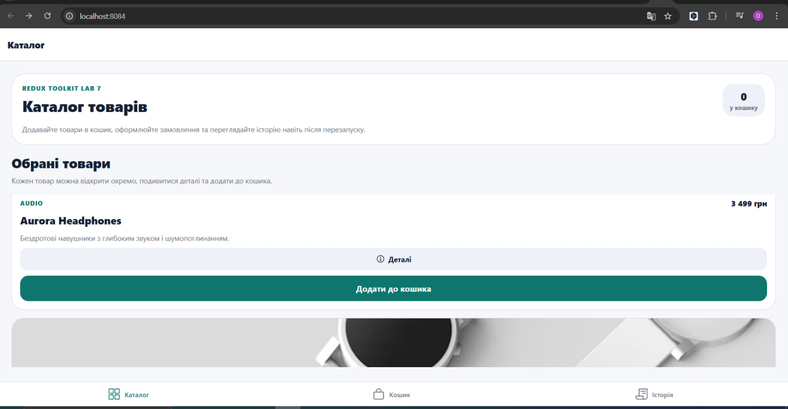
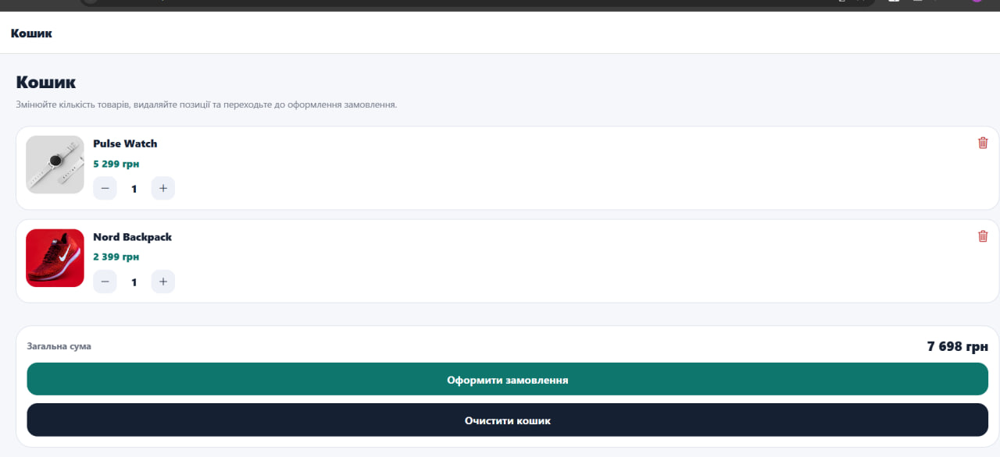
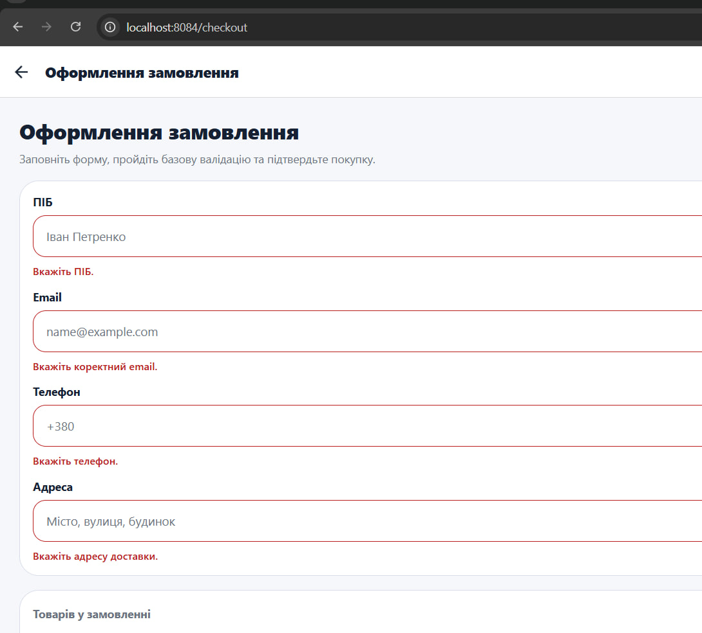
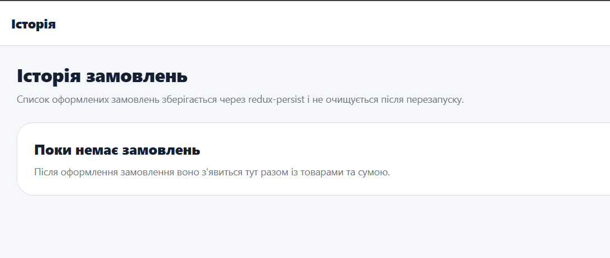

# Лабораторна робота №7

## Тема
Використання Redux Toolkit для управління станом при розробці мобільних застосунків.

## Мета
- ознайомитися з концепцією глобального стану у React Native-застосунках;
- вивчити архітектуру Redux Toolkit;
- засвоїти принципи роботи slice-редюсерів;
- опанувати збереження стану застосунку за допомогою `redux-persist`;
- сформувати навички побудови масштабованої архітектури мобільного застосунку.

## Функціонал
- каталог товарів із картками, зображеннями, цінами та переглядом деталей;
- додавання товарів до кошика;
- кошик із можливістю змінювати кількість товарів і видаляти позиції;
- автоматичний підрахунок загальної суми;
- оформлення замовлення через окрему форму;
- валідація ПІБ, email, телефону та адреси;
- збереження замовлень в історії;
- збереження стану кошика, історії та даних форми через `redux-persist` + `AsyncStorage`.

## Структура
- `app/(tabs)/index.tsx` - каталог товарів;
- `app/(tabs)/cart.tsx` - кошик;
- `app/(tabs)/orders.tsx` - історія замовлень;
- `app/checkout.tsx` - форма оформлення замовлення;
- `app/product/[id].tsx` - деталі товару;
- `store/slices/*` - Redux slice-редюсери;
- `store/index.ts` - налаштування Redux Store і `redux-persist`.

## Запуск
1. Встановити залежності:

```bash
npm install
```

2. Запустити застосунок:

```bash
npm run web
```

або

```bash
npm start
```

## Скріншоти
Реальні скріншоти роботи застосунку:









## Висновки
1. Глобальний стан у React Native дає змогу зберігати спільні дані для кількох екранів в одному місці.
2. Redux Toolkit спрощує створення Redux-архітектури завдяки `configureStore`, `createSlice` і вбудованим інструментам.
3. `createSlice` використовується для компактного опису стану, редюсерів і actions в одному місці.
4. `configureStore` створює Redux Store та автоматично підключає базові middleware.
5. `redux-persist` потрібен для збереження стану між перезапусками застосунку.
